# Computer Vision Segmentation for Document Layout Analysis

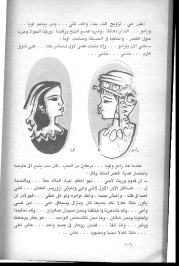

## Author

Murtadha

## Date

6th May 2020

---

## NOTES on CODE/DATA

The used data can be found on the BCE project website. It's divided into 5 sets, each has the raw image and its xml. When trying to replicate one algorithm you have to make sure that the data path is set to this folder.

All codes can be found in the /code folder. For each algorithm, there's a folder or a file having all its code.

To run the LABA algorithm, use the LABA.py file. There's no special dependencies for this file. Make sure to specify the data path correctly inside the code.

To run the MASRCNN algorithm, you need to download and follow the material/tutorial on their repo and then use the jupyter notebook in code/maskrcnn/samples/dla_code.ipynb. There's specific depdenncies for this code, you have to make sure that even the versions of libraries are correct as in requirements file code/maskrcnn/requirements.txt. If you are using MACOS then you might need to opt out from MKL backend; in conda pakaging, use the following command $conda install nomkl.

To run the DOCSCRUM algorthim, use the jupyter notebook in /code/docstrum/Docstrum_murt.ipynb. Install the depedencies appearing in the first cell, and make sure you use Python 2.7.

---

## Problem Statement

The Accuracy of OCR can be increased by applying document layout analysis (DLA) beforehand. A team at BU led by Prof. Margrit Betke has worked on studying the effect of this step on OCR performance over Arabic document images [1]. They also provided a benchmark dataset to assess that. The research was extended to investigate multiple ML approaches for applying DLA, such as SVM and deep NN. Currently, the task is divided into detection (physical layout analysis) and classification (logical layout analysis). The SVM approach uses CV techniques for detection, and SVM for classification. The NN approach uses Mask-RCNN for detection, and ResNet-18 for classification. The task of this project is to implement traditional CV techniques for page segmentation (detection), such as Docstrum algorithm, and compare its results to deep NN approach’s [3, 4].

## Related Work 

The proposed framework in [2] uses a rule-based algorithm to perform page segmentation. The output of this step is a list of contours. Afterwards, an SVM model is ran over the list of contours to predict its class. It achieves promising results, outperforming former NN framework. However, it doesn’t explore different methods for page segmentation, such as Docstrum or Voronoi-diagram based algorithm, which were shown to perform well in [5] and [6].

Six algorithms were evaluated in [5] based on their page segmentation performance. [5] extends the work done in [6] by adding three more algorithms for comparison. It uses the UW-III benchmark database. The PEST framework was used for evaluation, which was proposed by [7] to evaluate segmentation algorithms. The provided software, called PEST, takes care of the training-testing split, applying an error evaluation metrics, and producing comparison metrics across algorithms.

Recently, the shift in computer vision field is towards using convolutional neural networks algorithms to perform traditional CV tasks. Given the advances in GPU and computation, the NN approaches are getting more prominent position in the CV field. One of the wide used deep learning algorithms in object detection is Mask R-CNN [8]. In general, deep learning algorithms have gained their reputation in achieving state-of-the-art results for some CV benchmark tests. However, little work has been published in comparing NN algorithms with traditional CV approaches for the page segmentation task. Our goal is to fill this gap by providing such comparison.

---

## Data 

For evaluation, we use the benchmark dataset provided by [1], referred to as BCE. The BCE dataset has 1,800 images of Arabic book pages, with its layout annotation. The document images are given in a grayscale JPG format, while its layout annotation is given in XML format having the coordinates of the page layouts. Example of layouts coordinates of one page is given in *Figure 1*.

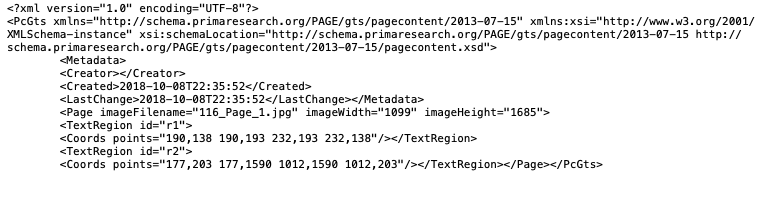

Figure 1 BCE Layouts Coordinates Example

## Methods 

In this project, three algorithms were considered for the page segmentation task. The used benchmark dataset is the BCE dataset collected and annotated by [1]. The selected algorithms are the Docstrum [6], the rule-based algorithm in LABA [2], and the Mask-RCNN in [8]. For all implementations, we used Python. OpenCV Python library, Keras and  Tensorflow.

## Docstrum

While the Docstrum algorithm has been introduces almost three decades ago, there is scarce resources about its implementation. The version used in [5] is a modification of the one used in [6]; *figure 2* provides its steps as given in [6]. Here we make use of the version shared by Chad Oliver[[1]](#_ftn1), which is an implementation of the algorithm in its original version introduced in [9]. Some bugs were fixed and the code was extended by Chulwoo Mike Pack to include grouped polylines and transfer them into bounding boxes[[2]](#_ftn2). We fixed some bugs in the latter code and update it to accommodate the changes in its dependencies.

****

Figure 2 Docscrum steps as given in [6]****

---

## Rule-based

The main contribution of [2] is in the logical layout analysis, however, since it achieves good results in this task we wanted to test its algorithm used in physical layout analysis. We used the same steps provided in the paper, given in *figure 3*. while trying as much as possible to tune the parameters for better performance. The paper doesn’t go into details of the used parameters.

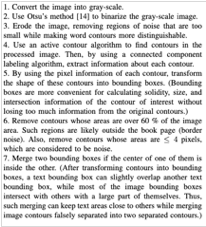

Figure 3 Rule-based algorithm steps as given in [2]

## Mask-RCNN 

Implantation Mask-RCNN is an algorithm that involves two stages, first, it generates proposals for regions of interest. Second, it classifies those identified regions. Due to the limitations imposed by the benchmark dataset, we have relied on pre-trained models to get a taste of its performance on page images. The used implementation in this project makes use of the Feature Pyramid Network (FPN) and a ResNet101 backbone [10].

## Results and Discussion 

Docscrum is one of three the highest performance algorithms in [5], however, it takes more time to compute its polylines k-means. This note about its speed, was also confirmed in [5, 6]. The accuracy of its results is not as promising as expected. Actually, given the time of computation the final results are modest. Example of its results are given in figure 4. We can notice that it fails to recognize the image and its captions, while doing mediocre performance in recognizing the text lines.

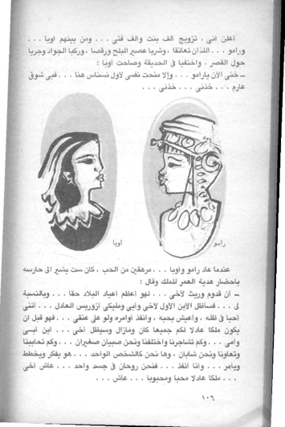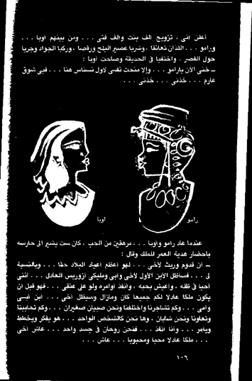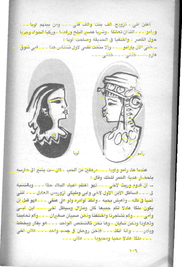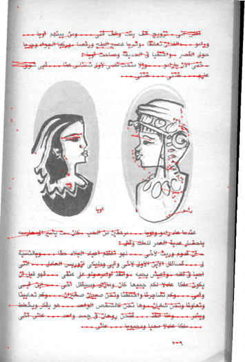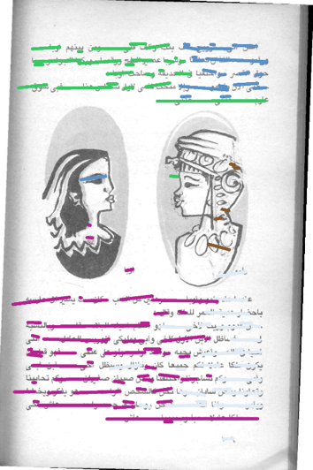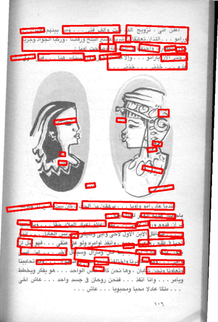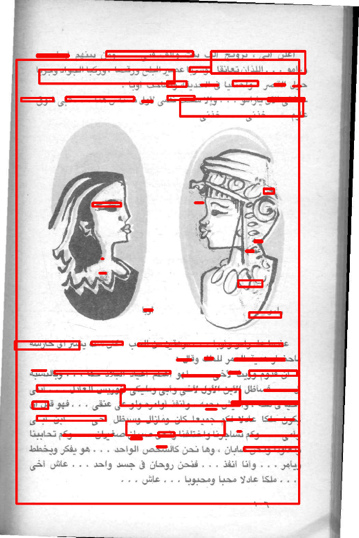

Figure 4 Steps in Docscrum algorithm; (a) original, (b) Otsu threshold, (c) lines of connected components, (d) polylines from k-means, € the polylines grouped depending on the position, (f) transfer to rectangular shape, and finally (g) transfer to bounding box of each group.

Even though the rule-based algorithm doesn’t make use of advanced techniques in image processing, similar to Docscrum, the final results are actually better. Moreover, its computation time is excellent and can produce a list of coordinates of the bounding boxes. The only drawback that might need to be resolved when evaluating the algorithm, is that bounding boxes are for words not regions. Example of rule-based algorithm results can be found in figure 5.

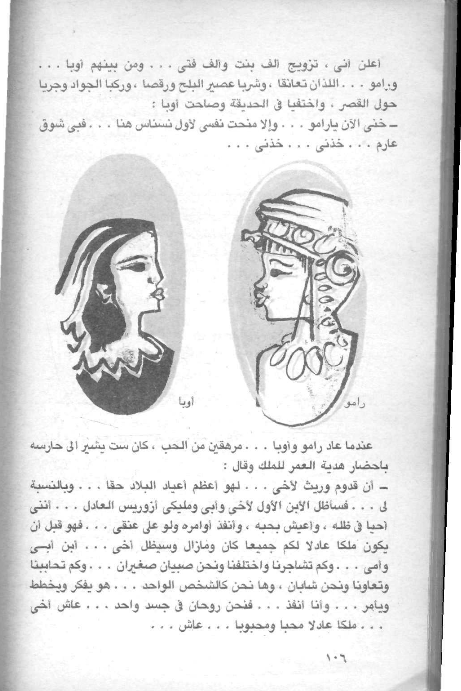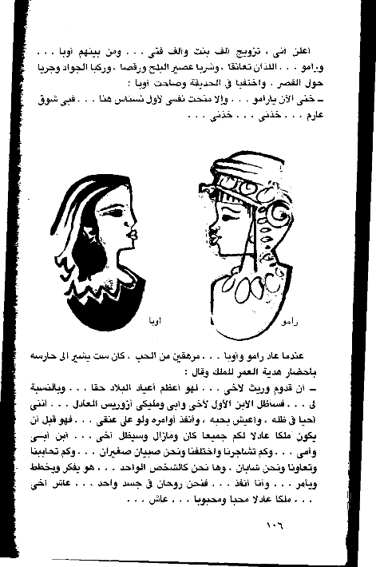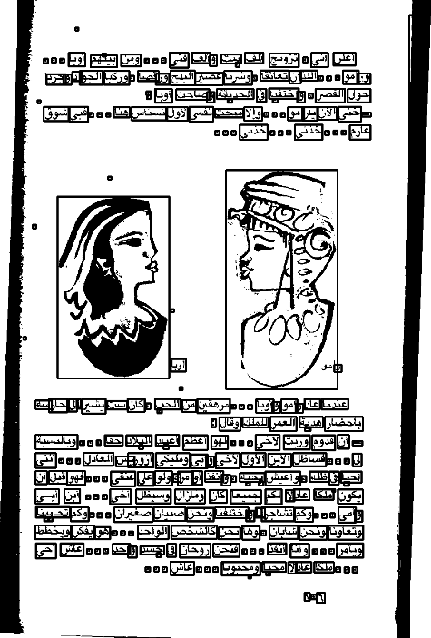

Figure 5 Steps in rule-based algorithm; (a) original, (b) convert to greyscale and Otsu thresholding, and (c) find contours and filter them based on size and location.

The Mask-RCNN pre-trained used in this project is for detecting object that are usually common in daily life, such as persons and cars. It uses the COCO dataset for training. The nature of our data is not similar to the COCO’s, however, we found that the model performed excellent results. It was able to detect blurred object in images and classify them. We think that should the Mask-RCNN model have been trained on the BCE dataset, its performance would yield more than 90% accuracy. Moreover, we see a practical usage of the pre-trained model in generating captions for images that don’t have them. Not only the performance is high, but also the computation time is fast. Examples of the pre-trained model results are given in figure 6.

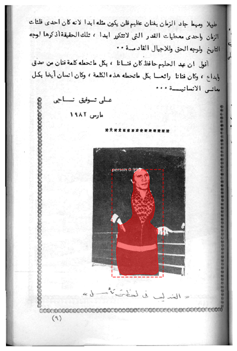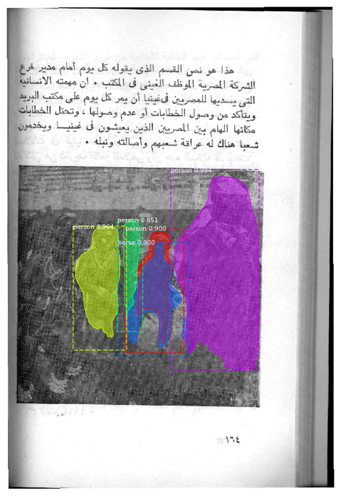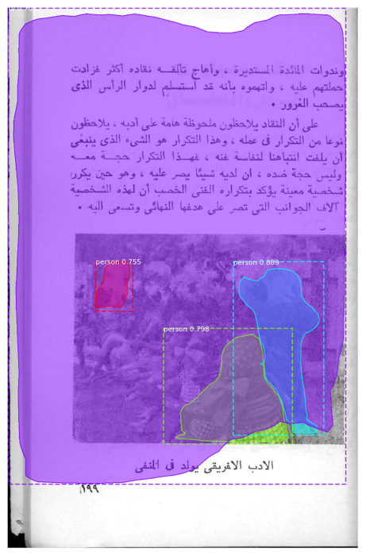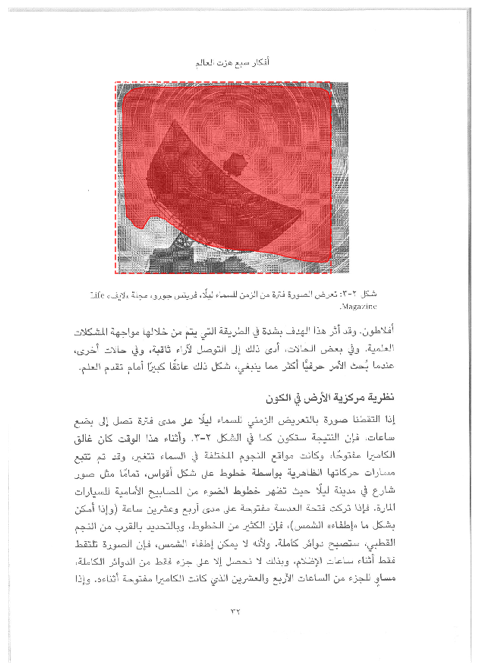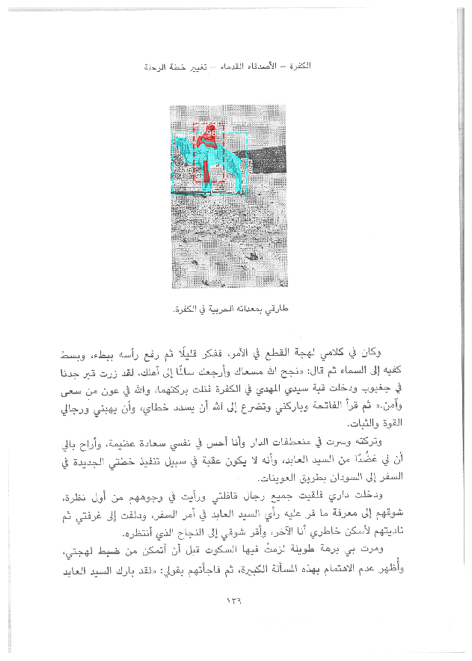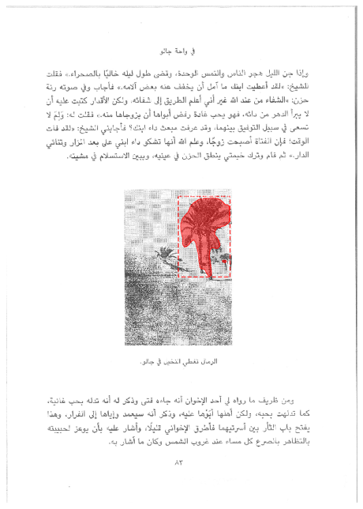

Figure 6 Some results from running Mask-RCNN algorithm; (a) person was detected, (b) group of persons were detected, (c) group of persons, (d) satellite station, € a person riding a camel, and (f) a palm tree.

---

## Conclusion 

Traditional CV algorithm, such as rule-based, not only achieve good results but also don’t require trained. On the other hand, NN algorithms require training but are capable of getting more information from the page images. We recommend using the rule-based algorithm for physical layout analysis in the absence of a training data, while using Mask-RCNN when data is available. We also recommend using Mask-RCNN for generating image captions and extract other information about the page images.

Even though the page segmentation task could be improved using different approaches, however, there are little discussion in the field about the DLA effect on OCR performance. Many studies emphasize on the importance of DLA; however, they don’t provide references or a quantitative discussion of that importance. Future work shall investigate that.

---

## Acknowledgment 

Many thanks to professor Margrit Betke for her dedication and support in this project and others; her spirit has been always a source of encouragement to learn more. The thanks are also extended to Wenda Qin for his ideas and time in getting me started with DLA. It was a wonderful experience to discuss and work closely with my colleague Georgios Karantonis during this computer vision class.

---

## References 

[1] Saad, Rana S. M., et al. “BCE-Arabic-v1 Dataset: Towards Interpreting Arabic Document Images for People with Visual Impairments.” *Proceedings of the 9th ACM International Conference on PErvasive Technologies Related to Assistive Environments - PETRA ’16*, ACM Press, 2016, pp. 1–8. *DOI.org (Crossref)*, doi:10.1145/2910674.2910725.

[2] W. Qin, R. Elanwar and M. Betke, "LABA: Logical Layout Analysis of Book Page Images in Arabic Using Multiple Support Vector Machines," 2018 IEEE 2nd International Workshop on Arabic and Derived Script Analysis and Recognition (ASAR), London, 2018, pp. 35-40.

[3] Jaekyu Ha, R. M. Haralick and I. T. Phillips, "Recursive X-Y cut using bounding boxes of connected components," Proceedings of 3rd International Conference on Document Analysis and Recognition, Montreal, Quebec, Canada, 1995, pp. 952-955 vol.2.

[4] Wong, K. Y., et al. “Document Analysis System.” *IBM Journal of Research and Development*, vol. 26, no. 6, Nov. 1982, pp. 647–56. *DOI.org (Crossref)*, doi:10.1147/rd.266.0647.

[5] Faisal Shafait, Daniel Keysers, and Thomas M. Breuel, Performance Comparison of Six Algorithms for Page Segmentation.

[6] Song Mao and Tapas Kanungo, Empirical Performance Evaluation Methodology and Its Application to Page Segmentation Algorithms.

[7] Song Mao1, Tapas Kanungo2, Software architecture of PSET: a page segmentation evaluation toolkit.

[8] Kaiming He, Georgia Gkioxari, Piotr Dollár, Ross Girshick, Mask R-CNN. 

[9] O'Gorman, L., 1993. The document spectrum for page layout analysis. IEEE Transactions on Pattern Analysis and Machine Intelligence, 15(11), pp.1162-1173.

[10] W. Abdulla, "Mask r-cnn for object detection and instance segmentation on keras and tensorflow." https://github.com/matterport/Mask RCNN, 2017.

* * * * *

[[1]](#_ftnref1) https://github.com/chadoliver/cosc428-structor

[[2]](#_ftnref2) https://github.com/chulwoopack/docstrum
